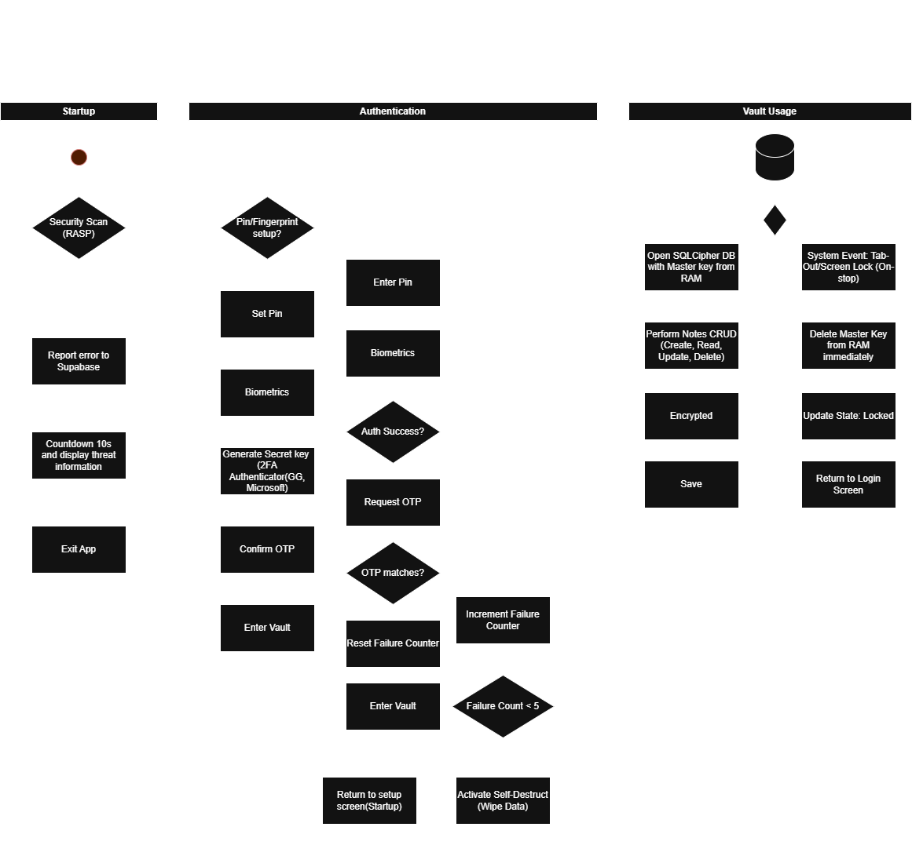

# 🛡️ CryptoVault

**CryptoVault** là một ứng dụng ví lưu trữ ghi chú bảo mật cao (Secure Note Vault) trên nền tảng Android, hoạt động theo cơ chế **Zero-Trust** và mô hình giám sát an ninh kết hợp **Hybrid Threat Monitoring**. Ứng dụng kết hợp sức mạnh bảo mật phần cứng local với hệ thống giám sát tập trung trên nền tảng đám mây để ngăn chặn triệt để các rủi ro rò rỉ dữ liệu trước spyware và các thiết bị đã bị can thiệp (Root/Tampered).

---

## ✨ Tính Năng Cốt Lõi (Key Features)

### 1. Pháo Đài Bảo Mật Lõi (Core Security Hardening)
* **Anti-Screenshot & Overlay:** Kích hoạt `FLAG_SECURE` trên toàn bộ Activity, chặn tuyệt đối việc chụp ảnh, quay video màn hình hoặc các cuộc tấn công dạng Tapjacking (phủ giao diện giả mạo).
* **Hardware-backed Encryption:** Sử dụng cơ sở dữ liệu **Room Database** tích hợp lớp mã hóa vật lý toàn phần **SQLCipher**. Khóa giải mã DB (`Master Key`) được sinh ra và lưu trữ độc quyền trong chip bảo mật phần cứng **Android Keystore System (TEE/StrongBox)**, không bao giờ xuất hiện dưới dạng chữ rõ (Plaintext) trên bộ nhớ.

### 2. Xác Thực Đa Lớp Linh Hoạt (Multi-Factor Authentication - MFA)
* **Biometric Shield:** Tự động kích hoạt `BiometricPrompt` (Vân tay/Khuôn mặt) ngay khi mở ứng dụng để giải phóng khóa giải mã từ Keystore.
* **Mã PIN Dự Phòng Bảo Mật:** Cơ chế fallback bằng mã PIN được băm một chiều qua thuật toán **PBKDF2 kết hợp Salt ngẫu nhiên**, lưu trữ an toàn trong Jetpack DataStore nhằm chống dò mã (Bruteforce) khi máy bị trích xuất bộ nhớ.
* **Offline 2FA (TOTP):** Tích hợp xác thực lớp hai bằng cách liên kết với các ứng dụng Authenticator bên ngoài (Google/Microsoft Authenticator) dựa trên thuật toán **Time-Based One-Time Password (RFC 6238)** hoạt động hoàn toàn offline dưới máy.

### 3. Hệ Thống Giám Sát An Ninh Tập Trung (Hybrid Threat Monitoring)
* **RASP (Runtime Application Self-Protection):** Tích hợp bộ thư viện quét môi trường thời gian thực, phát hiện ngay lập tức nếu thiết bị đã bị Root, đang bật USB Debugging, chạy trên Trình giả lập (Emulator), hoặc có dấu hiệu bị Tampering.
* **Auto-Lock & Key Destruction:** Tự động xóa sạch Master Key trên RAM khi ứng dụng bị đẩy xuống nền (`onStop()`). Nếu phát hiện dò PIN hoặc xâm nhập liên tiếp, app tự kích hoạt cơ chế tự hủy (Xóa sạch SQLCipher DB).
* **Realtime Centralized Log Sync:** Khi phát hiện đe dọa, app lập tức khóa để tự vệ dưới local, đồng thời âm thầm đẩy một gói tin mã hóa chứa Metadata thiết bị và loại Threat lên hệ thống **Supabase (PostgreSQL Cloud)** để phục vụ việc giám sát tập trung trên Admin Portal.

---

## 🏗️ Kiến Trúc Hệ Thống (Architecture)

Dự án tuân thủ nghiêm ngặt mô hình **Clean Architecture** kết hợp kiến trúc **MVVM (Model-View-ViewModel)** và phân tách thư mục theo tính năng (**Package by Feature**):

* **Presentation Layer:** Xây dựng giao diện khai báo hoàn toàn bằng **Jetpack Compose** kết hợp Material 3 Adaptive Layout (tự động co giãn theo thiết bị), quản lý trạng thái UI thông qua **Kotlin Flow**.
* **Domain Layer:** Nơi chứa các nghiệp vụ cốt lõi (Business Logic) tách biệt hoàn toàn dưới dạng các `UseCases` độc lập để tối ưu cho việc viết Unit Test.
* **Data Layer:** Đóng vai trò thực thi kỹ thuật, giao tiếp trực tiếp với hệ thống mật mã Android, SQLCipher Room DB, DataStore, và gọi API REST kết nối đồng bộ dữ liệu bảo mật lên Cloud.

---

## 🛠️ Công Nghệ Sử Dụng (Tech Stack)

* **Language:** Kotlin (Modern Android Development)
* **UI Framework:** Jetpack Compose & Material 3
* **Database:** Room Database + SQLCipher
* **Security SDKs:** Android Biometric API, Android Keystore, RootBeer (RASP)
* **Asynchronous:** Kotlin Coroutines & Flow
* **Cloud Backend:** Supabase (PostgreSQL Distributed Server)
* **Network Client:** OkHttp3

## 🛡️ Kiến Trúc Bảo Mật & Quy Trình Hoạt Động

Kiến trúc bảo mật cốt lõi của **CryptoVault** được chia thành 3 giai đoạn chính: Bảo vệ thời gian chạy (Startup), Xác thực đa lớp (Authentication), và Quản lý dữ liệu an toàn trong bộ nhớ (Vault Usage).

### 1. Giai đoạn Khởi động (Quét mã độc RASP)
Ngay khi ứng dụng được khởi chạy, các biện pháp phòng vệ sẽ được thực thi lập tức trước khi hiển thị bất kỳ giao diện nào cho người dùng:
* **Quét bảo mật (RASP):** Ứng dụng thực hiện các kiểm tra tự bảo vệ (Runtime Application Self-Protection) để phát hiện thiết bị đã Root, công cụ bẻ khóa (Hooking frameworks), trình giả lập, hoặc chữ ký ứng dụng bị thay đổi.
* **Xử lý mối đe dọa:**
    * Nếu phát hiện nguy hiểm: Hệ thống sẽ ghi nhận thông tin chi tiết về mối đe dọa, gửi báo cáo lỗi về **Supabase**, kích hoạt đồng hồ đếm ngược 10 giây để hiển thị cảnh báo cho người dùng và buộc thoát ứng dụng (`Exit App`).
    * Nếu môi trường thiết bị an toàn: Ứng dụng sẽ chuyển sang giai đoạn Xác thực.

### 2. Giai đoạn Xác thực (Quy trình Đa lớp & Dự phòng)
Đảm bảo xác minh danh tính người dùng tuyệt đối thông qua luồng thiết lập ban đầu hoặc đăng nhập:
* **Thiết lập lần đầu (Người dùng mới):**
    * Kiểm tra xem đã có mã PIN hoặc Vân tay chưa. Nếu chưa:
    * Người dùng được yêu cầu **Cài đặt PIN** $\rightarrow$ Cấu hình **Sinh trắc học (Biometrics)** $\rightarrow$ **Khởi tạo Khóa bí mật (Secret Key)** (dành cho 2FA qua Google/Microsoft Authenticator) $\rightarrow$ **Xác nhận OTP** $\rightarrow$ **Vào Vault**.
* **Luồng đăng nhập (Người dùng cũ):**
    * Người dùng trải qua lớp xác thực đầu tiên: **Nhập PIN** hoặc quét **Vân tay**.
    * **Kiểm tra Xác thực Thành công:**
        * **Nếu thành công:** Ứng dụng yêu cầu xác thực **Mã OTP** $\rightarrow$ Kiểm tra xem **OTP có khớp không**.
            * Nếu OTP khớp: Hệ thống sẽ **Đặt lại Bộ đếm số lần sai** và cho phép người dùng **Vào Vault**.
            * Nếu OTP sai: Ứng dụng đưa người dùng quay lại màn hình thiết lập/khởi động.
        * **Nếu thất bại:** Hệ thống thực hiện cơ chế phòng vệ tăng cường:
            * **Tăng Bộ đếm số lần sai** $\rightarrow$ Kiểm tra điều kiện `Số lần sai < 5`.
            * Nếu người dùng nhập sai liên tiếp 5 lần, hệ thống sẽ kích hoạt cơ chế **Tự hủy (Xóa toàn bộ dữ liệu - Wipe Data)** để đưa các kho lưu trữ mã hóa về trạng thái trống trống hoàn toàn.

### 3. Giai đoạn Sử dụng Vault & Vòng đời Dữ liệu
Định nghĩa cách dữ liệu mã hóa được xử lý trên RAM và cách ứng dụng phản ứng khi bị gián đoạn:
* **Trạng thái Hoạt động (Active):**
    * Mở **SQLCipher Database** bằng cách sử dụng Khóa Master Key tạm thời được lưu giữ an toàn trên RAM.
    * Cho phép người dùng thực hiện các thao tác **CRUD Ghi chú** (Tạo, Đọc, Sửa, Xóa) cơ bản.
    * Nội dung ghi chú liên tục được **Mã hóa** và lưu trữ an toàn (`Save`) ngược trở lại database.
* **Trạng thái Bị động (Khi có sự kiện hệ thống - Thoát app/Khóa màn hình):**
    * Kích hoạt thông qua các sự kiện vòng đời của Android (ví dụ: `onStop`).
    * **Xóa Khóa Master Key khỏi RAM ngay lập tức:** Ngăn chặn các cuộc tấn công trích xuất bộ nhớ (memory-dump) hoặc tấn công khởi động lạnh (cold-boot).
    * **Cập nhật trạng thái: Đã khóa (Locked):** Hủy bỏ trạng thái giao diện hiện tại.
    * **Quay lại màn hình Đăng nhập:** Buộc người dùng phải xác thực lại hoàn toàn từ đầu khi mở lại ứng dụng.

